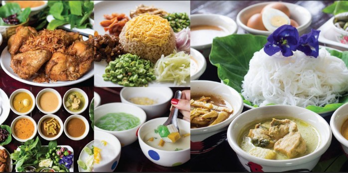
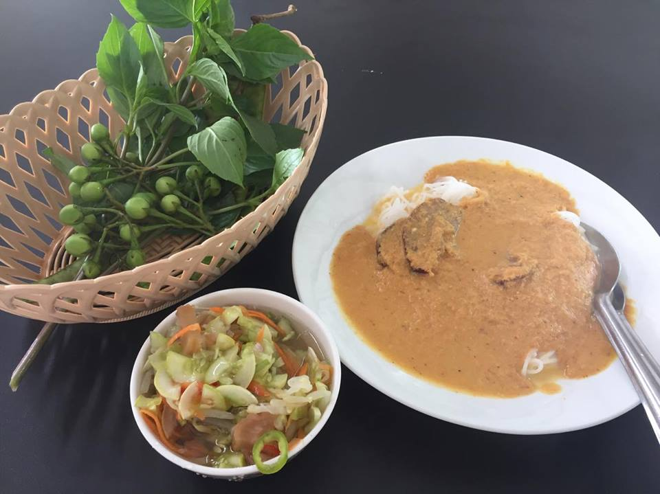
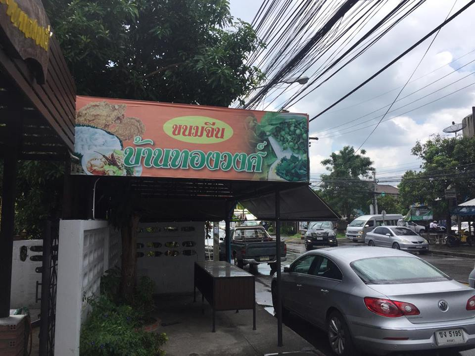
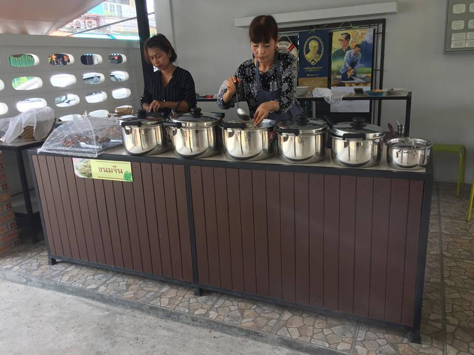
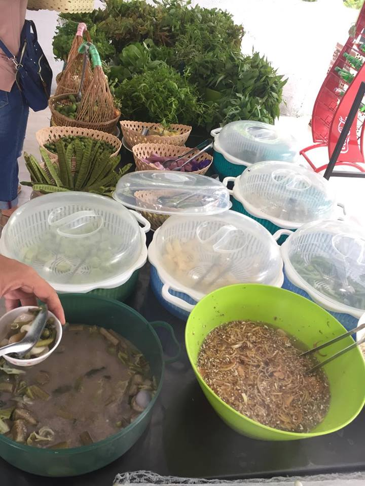
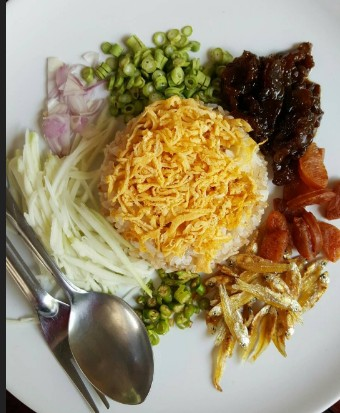
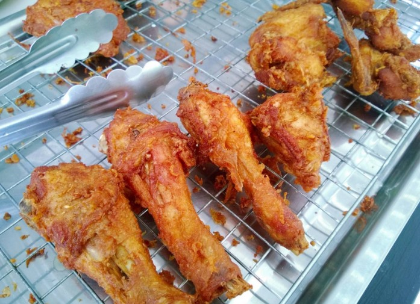

<html>
<title>W3.CSS Template</title>
<meta charset="UTF-8">
<meta name="viewport" content="width=device-width, initial-scale=1">
<link rel="stylesheet" href="https://www.w3schools.com/w3css/4/w3.css">

<body>

<!-- Navbar (sit on top) -->

  

    <a href="#home" class="w3-bar-item w3-button w3-large">10ร้านห้ามพลาดในหาดใหญ่</a>
    <!-- Right-sided navbar links. Hide them on small screens -->
    

      <a href="#about" class="w3-bar-item w3-button">HOME</a>
      <a href="#menu" class="w3-bar-item w3-button">FOOD</a>
      
    

  

<!-- Header -->
<header class="w3-display-container w3-content w3-wide" style="max-width:1600px;min-width:500px" id="home">
  
  

    <h1 class="w3-xxlarge w3-animate-left w3-card-4">"ขนมจีนบ้านทองวงค์" </h1>
  

</header>

<!-- Page content -->

  <!-- About Section -->
  

    

     
    

    

      <h1 class="w3-center w3-animate-left w3-card-4 w3-border w3-hover-red ">ขนมจีนบ้านทองวงค์</h1>

      <h5 class="w3-center">ขนมจีนขึ้นชื่อในหาดใหญ่</h5>
      
อิ่ม คุ้ม ครบ ไม่เกินร้อย ขนมจีนเส้นสด “ร้านขนมจีนบ้านทองวงศ์” หาดใหญ่ อิ่มคุ้ม กับร้าน “ขนมจีนบ้านทองวงศ์” เมืองหาดใหญ่ ขนมจีนเส้นสด ครบครันทั้งเครื่องเคียง ไก่ทอด ขนมหวาน และข้าวคลุกกะปิ ในราคาเบา ๆ แบงค์ร้อยเอาอยู่

      ต้องลอง !
      
	  

  

  

  <!-- Menu Section -->
  

    

      <h1 class="w3-center w3-card-4 w3-border w3-hover-red">ข้อมูลร้าน</h1> 
      <h4>เวลาเปิดร้าน</h4>
      
จันทร์ - เสาร์: 08:30 - 15:00
 

      <h4>ที่ตั้งและบรรยากาศ</h4>
      
ร้านนี้ตั้งอยู่ตรงคลองเรียน 1 เยื้องกับร้านข้าวมันไก่เชฟหมง 
      ภายในร้านดูโล่ง โต๊ะที่นั่งถูกจัดวางเป็นระเบียบ ดูสะอาดสะอ้านน่านั่งมากครับ แถมมี Free WiFi
 

      <h4>ช่วงราคา</h4>
      
ต่ำกว่า 100 บาท
 

      <h4>เบอร์ติดต่อ</h4>
      
081-0925660
 

      <h4>ช้อมูลอื่นๆ</h4>
      
มีที่จอดรถ 
      เหมาะสำหรับมาเป็นกลุ่ม 
      มี 41-80ที่นั่ง 

    

    

      
    

  

  

<!-- End page content -->

  <h2>รูปภาพเพิ่มเติม</h2>
  
ชมบรรยากาศและอาหาร

  
  

    ขนมจีนน้ำยา
  

  
  

    มีน้ำแกงให้เลือกมากมาย
  

  
  

    เครื่องเคียง
  

  
  

    ข้าวคลุกกะปิ
  

  
  

    ไก่ทอด
  

<button class="w3-button w3-display-left w3-black" onclick="plusDivs(-1)">&#10094;</button>
<button class="w3-button w3-display-right w3-black" onclick="plusDivs(1)">&#10095;</button>

<!-- Footer -->
<footer class="w3-center w3-light-grey w3-padding-32">
  
ติดต่อพวกเรา<a href="https://www.facebook.com/timargolf" title="W3.CSS" target="_blank" class="w3-hover-text-green">Facebook</a>

</footer>

